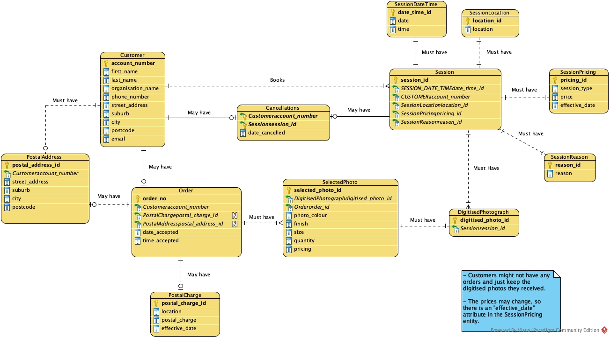

# APU-PhotographyDB-CaseStudy
This project is part of the COMP508 Database System Design course at Auckland University of Technology, focusing on developing a comprehensive database system for a photography business. It covers entity relationship modeling, logical database design, and implementation using Oracle SQL and Visual Paradigm.

## Key Features
- Entity-Relationship Diagram (ERD): Visual representation of the database schema.
- Database Implementation: SQL scripts for creating and populating the database tables.
- SQL Queries: Advanced SQL queries for data retrieval.

## Tools Used
- Oracle SQL Developer: For database management and SQL scripting.
- Visual Paradigm: For designing the Entity-Relationship Diagram.

## Entity Relationship Diagram

The diagram above represents the Entity Relationship Diagram for the APU Photography Booking System.

## File Structure
- APU_System_Model_ERD.jpg: Entity-Relationship Diagram for the APU Photography Database.
- DatabaseCreation.sql: SQL script for creating database tables.
- DataInsertion.sql: SQL script for populating tables with sample data.
- DataRetrievalQueries.sql: SQL queries for data retrieval.

## Getting Started
1. Clone the Repository: git clone [repository URL]
2. Set up Oracle SQL Developer: Ensure Oracle SQL Developer is installed and configured.
3. Database Setup: Run DatabaseCreation.sql in Oracle SQL Developer to create the database schema.
4. Populate Database: Execute DataInsertion.sql to insert sample data into the database.
5. Run Queries: Use DataRetrievalQueries.sql to perform data retrieval operations.

## Acknowledgements
Thanks to the faculty and peers at AUT for guidance and support throughout this project.

## License
This project is for educational purposes and not licensed for commercial use.
